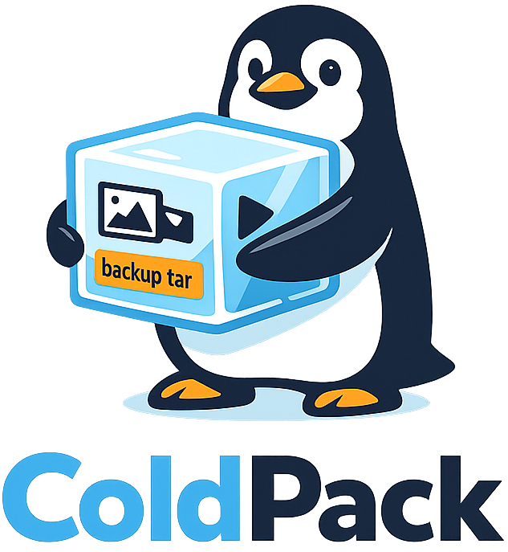

<p align="center">
  
</p>

**Extremely cheap disaster recovery for personal photos, videos, and files.**

Traditional backup tools upload every file as a separate S3 object. With 60,000 photos that means 60,000 objects — each incurring per-request fees, minimum storage charges, and retrieval costs. Coldpack solves this by bundling files into monthly tar archives, reducing tens of thousands of objects down to a handful. The result: pennies per month for hundreds of gigabytes of storage, with full file-level searchability via a local manifest.

Built for NAS users who produce files at a regular cadence (daily photo syncs, monthly video dumps) and want off-site disaster recovery without the cost of traditional cloud backup services.

**Key features:**
- Bundles files into monthly tar archives (minimal S3 object count = minimal cost)
- Move/rename detection (reorganized files are not re-uploaded)
- Full file-level manifest for browsing and selective restore without downloading everything
- Resumable multipart uploads with integrity verification
- Two-step Glacier restore workflow (request → download after ~12 hours)
- Configurable storage class (STANDARD for testing, DEEP_ARCHIVE for production)

## Cost Estimate

For ~500 GB of photos/videos:
- Storage: ~$0.50/month (Deep Archive at $0.00099/GB/month)
- Monthly upload: ~$0.05 (PUT requests + data transfer for 1-2.5 GB)
- Manifest: negligible (few MB in S3 Standard)
- Full restore: ~$10 + $0.02/GB retrieval (one-time disaster recovery)

## Getting Started

### 1. Install

**Linux / macOS:**

```bash
curl -fsSL https://raw.githubusercontent.com/gcacace/coldpack/master/install.sh | sh
```

**Windows (PowerShell):**

```powershell
irm https://raw.githubusercontent.com/gcacace/coldpack/master/install.ps1 | iex
```

Or download a binary directly from [Releases](https://github.com/gcacace/coldpack/releases).

<details>
<summary>Build from source</summary>

Requires the [Rust toolchain](https://rustup.rs/):

```bash
cargo build --release
```

The binary is at `target/release/coldpack` (~23 MB). Copy it to your target machine:

```bash
scp target/release/coldpack your-nas-ip:/usr/local/bin/
```

</details>

### 2. Configure AWS Credentials

Create a credentials file on the machine where coldpack will run:

```bash
mkdir -p ~/.aws
cat > ~/.aws/credentials << 'EOF'
[default]
aws_access_key_id = YOUR_ACCESS_KEY
aws_secret_access_key = YOUR_SECRET_KEY
EOF
chmod 600 ~/.aws/credentials
```

The AWS SDK reads this file automatically — no environment variables needed.

**IAM Policy:** Create a dedicated IAM user with minimal permissions:

```json
{
  "Version": "2012-10-17",
  "Statement": [
    {
      "Effect": "Allow",
      "Action": [
        "s3:PutObject",
        "s3:GetObject",
        "s3:HeadObject",
        "s3:ListMultipartUploadParts",
        "s3:AbortMultipartUpload",
        "s3:ListBucketMultipartUploads",
        "s3:CreateMultipartUpload",
        "s3:CompleteMultipartUpload",
        "s3:RestoreObject"
      ],
      "Resource": [
        "arn:aws:s3:::YOUR-BUCKET-NAME",
        "arn:aws:s3:::YOUR-BUCKET-NAME/*"
      ]
    }
  ]
}
```

### 5. Run the Setup Wizard

On the NAS, run the interactive setup:

```bash
coldpack setup
```

The wizard walks you through every setting step by step:
- S3 bucket name and AWS region
- Storage class (choose STANDARD for testing, DEEP_ARCHIVE for production)
- Source directories with labels (e.g., "marco", "laura", "common")
- Cutoff strategy (defaults to ignoring current month's files)
- Performance settings

This creates a profile at `~/.coldpack/profiles/default/config.toml`.

To create additional profiles (e.g., for a different backup set):
```bash
coldpack setup --profile work-laptop
```

### 6. Verify with a Dry Run

```bash
coldpack backup --dry-run
```

This scans your source directories and shows what would be backed up without uploading anything:

```
⠙ Scanned 12,345 files (12298 new, 0 modified, 0 moved, 2847 excluded)

Dry run — backup plan:
  Storage class: STANDARD
  Max archive size: 10240 MB
  Archives to create: 78 (12298 files, ~180.5 GB)

    2016-03: 2.1 GB (45 files)
    2016-04: 3.8 GB (62 files)
    ...
    2026-04: 1.9 GB (52 files)

(dry run — no changes made)

Scan complete:
  Files scanned: 12345
  Skipped (cutoff): 47
  Skipped (excluded): 2847
  Unchanged: 0
  New: 12298
  Modified: 0
  Moved: 0
  Deleted: 0
```

### 7. Run Your First Backup

```bash
coldpack backup
```

### 8. Schedule Monthly Backups (Synology Task Scheduler)

In **DSM > Control Panel > Task Scheduler**, create a new **User-defined script**:

- **Task**: coldpack monthly backup
- **User**: same user that owns `~/.aws/credentials` (usually `root`)
- **Schedule**: 2nd of every month, 3:00 AM
- **Command**:

```bash
nice -n 19 ionice -c 3 /usr/local/bin/coldpack backup >> /var/log/coldpack.log 2>&1
```

The `nice -n 19 ionice -c 3` flags run coldpack at the lowest CPU and I/O priority, so it won't interfere with Home Assistant or other NAS services running overnight.

**Important:** If the Task Scheduler runs as `root` but your AWS credentials are under a different user's home directory, either:
- Place credentials at `/root/.aws/credentials`, or
- Add `export HOME=/var/services/homes/your-user` at the top of the script

## Profiles

All commands support `--profile <name>` to target a specific profile. If omitted, the `default` profile is used.

```bash
# Use default profile
coldpack backup --dry-run

# Use a named profile
coldpack --profile work-laptop backup --dry-run
coldpack --profile work-laptop status
```

Each profile is fully isolated — its own config, manifest cache, upload checkpoints, and restore state.

### Example Profile Configuration

`~/.coldpack/profiles/default/config.toml`:

```toml
[storage]
bucket = "my-family-backup"
region = "eu-west-1"
archive_prefix = "archives/"
manifest_prefix = "manifest/"
storage_class = "DEEP_ARCHIVE"

[[backup.sources]]
name = "marco"
path = "/volume1/homes/marco/Photos"

[[backup.sources]]
name = "laura"
path = "/volume1/homes/laura/Photos"

[[backup.sources]]
name = "common"
path = "/volume1/photos/family"

[backup]
max_archive_size_mb = 10240
tmp_dir = "/volume1/tmp/coldpack"

[backup.filter]
cutoff = "start_of_current_month"
exclude = ["@eaDir", "#recycle", ".DS_Store", "Thumbs.db"]

[performance]
max_io_workers = 2
```

**Configuration reference:**

| Field | Default | Description |
|-------|---------|-------------|
| `storage.bucket` | (required) | S3 bucket name |
| `storage.region` | (required) | AWS region |
| `storage.archive_prefix` | `archives/` | S3 key prefix for archives |
| `storage.manifest_prefix` | `manifest/` | S3 key prefix for manifest |
| `storage.storage_class` | `DEEP_ARCHIVE` | S3 storage class (`STANDARD`, `STANDARD_IA`, `GLACIER_IR`, `GLACIER`, `DEEP_ARCHIVE`) |
| `backup.max_archive_size_mb` | `10240` (10 GB) | Max size per archive before splitting |
| `backup.tmp_dir` | system temp | Directory for building archives before upload |
| `backup.filter.cutoff` | `start_of_current_month` | Only backup files older than this (`YYYY-MM-DD`, `start_of_current_month`, or `none`) |
| `backup.filter.exclude` | `[]` | Path patterns to skip (`@eaDir`, `*.tmp`, etc.) |
| `performance.max_io_workers` | `2` | Concurrent fingerprint reads |

## Commands

### `coldpack setup [--profile <name>]`

Interactive wizard to create or overwrite a profile configuration.

### `coldpack backup [--dry-run] [--cutoff <date|"none">] [-v]`

Scan all configured sources, detect changes, create tar archives grouped by month (one per data month), upload to S3, and update the manifest incrementally after each archive.

- `--dry-run`: Show the full backup plan (archives, sizes, file lists) without uploading
- `--cutoff 2026-05-01`: Override the cutoff date (only backup files older than this)
- `--cutoff none`: Backup everything regardless of file age
- `-v` / `--verbose`: Show each skipped file with its reason (`[excluded]`, `[cutoff]`, `[unchanged]`)

### `coldpack browse [--path <glob>] [--after <date>] [--before <date>]`

Search the manifest for backed-up files.

```bash
# All files
coldpack browse

# Only Marco's photos from 2026
coldpack browse --path "marco/2026/**"

# All videos
coldpack browse --path "**/*.mp4"

# Files modified in May 2026
coldpack browse --after 2026-05-01 --before 2026-06-01
```

### `coldpack restore-request [--all | --path <glob> | --archive <id>] [--include-deleted] [--include-versions [all]]`

Initiate Glacier Deep Archive restoration (takes ~12 hours):

```bash
# Restore everything
coldpack restore-request --all

# Restore specific files
coldpack restore-request --path "marco/2026/05/**"

# Restore a specific archive
coldpack restore-request --archive "backup-2026-05-02T03:00:00Z"

# Include archives needed for older versions and deleted files
coldpack restore-request --all --include-deleted --include-versions all
```

Use `--include-deleted` and `--include-versions` to also request the archives that contain older versions and deleted files from Glacier. Pass the same flags to `restore-download` later.

### `coldpack restore-download [--output <dir>] [--include-deleted] [--include-versions [all]]`

Download files that have been restored from Glacier:

```bash
# Restore only current files (moved files appear at their latest path)
coldpack restore-download --output /volume1/restored

# Also restore files that were deleted before the disaster
coldpack restore-download --output /volume1/restored --include-deleted

# Include the most recent previous version of modified files
coldpack restore-download --output /volume1/restored --include-versions

# Include ALL historical versions of modified files + deleted files
coldpack restore-download --output /volume1/restored --include-deleted --include-versions all
```

Run this ~12 hours after `restore-request`. Files that were moved/renamed are automatically restored to their most recent path. Deleted files and older versions go to `__versions/`, grouped by archive date:

```
/volume1/restored/
  marco/photo.jpg                          # Current file (latest version, at current path)
  common/moved-photo.jpg                   # File that was moved (restored to new path)
  __versions/
    2026-03-01/marco/old-deleted.jpg       # Deleted file (--include-deleted)
    2026-03-01/marco/photo.jpg             # Older version from March (--include-versions all)
    2026-05-15/marco/photo.jpg             # Older version from May (--include-versions all)
```

### `coldpack status`

Show backup summary and pending operations.

### `coldpack cleanup`

Remove stale multipart upload checkpoints and abort orphaned uploads.

## How It Works

### Change Detection

On each backup run, coldpack compares the current state of your NAS folders against the manifest:

| State | Condition | Action |
|-------|-----------|--------|
| Unchanged | Same path, same mtime + size | Skip |
| Modified | Same path, different mtime or size | Include in archive |
| Moved | New path, same fingerprint (xxHash of first 64KB + file size) | Update manifest only |
| New | New path, no fingerprint match | Include in archive |
| Deleted | Path in manifest gone, no move match | Mark deleted in manifest |

### Move Detection

When you move a photo between folders (e.g., from your personal folder to the family shared folder), coldpack recognizes it by fingerprint and updates the manifest without re-uploading. This saves bandwidth and storage costs.

### Cutoff Filter

By default, coldpack ignores files modified in the current month. This gives your NAS daily-sort job time to move photos to the right `year/month/` folder before they're backed up. Running on the 2nd of each month means you back up everything through the last day of the previous month.

### Monthly Archive Grouping

Files are grouped into archives by their modification month (`backup-2024-05-run20260602T030000.tar`). If a single month exceeds `max_archive_size_mb` (default 10 GB), it's split into parts. This means:
- Selective restore can pull just the months you need
- Archives sort chronologically in S3 listings
- A single oversized file gets its own archive (can't split a file)

### Archive Format

Archives use **tar** (no compression). Photos and videos are already compressed formats — deflate adds CPU cost with zero benefit. Tar preserves full file metadata: modification time (nanosecond precision), unix permissions, and file ownership.

### Resumable Uploads

If a backup is interrupted (power loss, network issue), the next run automatically resumes from where it left off. Upload progress is checkpointed locally after each 100 MB part. The manifest is saved after each archive upload, so only the in-progress archive needs to be re-created on restart.

## File Layout

```
~/.coldpack/
  profiles/
    default/                     # Default profile
      config.toml                # Profile configuration
      manifest.json              # Local manifest cache
      uploads/                   # Upload checkpoints (temporary)
      restores/                  # Restore job state
    work-laptop/                 # Another profile (fully isolated)
      config.toml
      manifest.json
      uploads/
      restores/

s3://<bucket>/
  manifest/manifest.json         # Authoritative manifest (S3 Standard)
  archives/backup-<YYYY-MM>-run<timestamp>.tar   # Monthly backup archives (Deep Archive)
```
